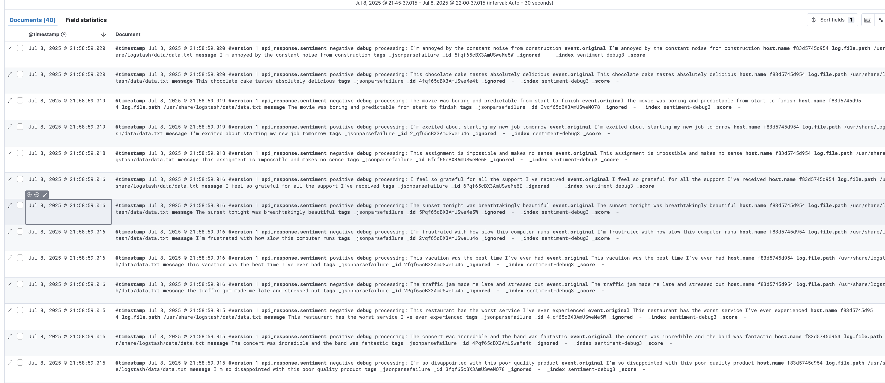

# axone-test

## Technical take-home test for axone data:

### Questions 1 & 2 are inside `question2`:

The setup is done entirely with docker compose, more difficult to setup intially, but it makes it available for all platforms and setups(i also have no windows/ubuntu machine, but macos is unix = linux). Make sure your data is in `logstash/data/data.txt`. Modify the `logstash.conf` if you want to change the filename.
All you need is to run `docker compose build && docker compose run`.
The data is 20-30 sentences generated by ai. (cannot use bigger datasets because of compute restraints. my pc cannot allow bigger loads). Logstash reads `logstash/data/data.txt` and sends each row to the api to be classified.
The classification step is a simple hugging face `pipeline` for sentiment analysis, served via a fastapi endpoint `predict` on port 8000 inside a Dockerfile.
This endpoint communicates with `logstash` through the `http` definition. More details in the `logstash.conf` file.
An alternative approach is to use `eland` directly, but it requires a trial subscription.
Screenshots are inside the question2 folder.

Results :

Diagram :

0.0 - ELK Installed and working:

1.0 - Login :

2.0 - Classification API

2.1 - Endpoint processing the data

3.0 - Data with prediction in logstash

3.1 - Logstash logs

Note: I couldn't change the logo. i tried swapping the location of icon but it didn't work.

### Question 3:

The goal of question 3, is to scrape data from facebook and store them in a document store (mongo).
To achieve this, we used `selenium` which is a headless browser, to bypass anti-bot measures and simulate human users. Data is scraped by targetting some css selectors, that we found out through manual search. The data is the stored into `data/data.csv`, then we apply a script to clean and remove duplicates, resolting in a new clean file `data/clean.csv`.
Then, we use `pymongo` through a custom loader class, to load the data successfully into our document store, for potential use by our analysts.

The main difficulties of the question, is bypassing anti-bot measures and finding out the cause of the duplication. We managed to do this by simulating human behaviour (typing character by character, waiting between before each field, stealthy headers...)
We managed to correctly scrape text + images, and store them into mongo with best data quality.

Finally, we have made an airflow pipeline that executes each job (extract, transform, load) in a DAG. However, it only fetches 1 scroll due to the compute constraints that we have (5 scrolls take 30+ mns). This is made to demonstrate how it will be in a production scenario.

## Details:

    - how to run:
        - local :
            - install uv: `pip install uv`
            - sync uv to install requirements: `uv sync`
            - run :  `uv run src/extract.py --query "deces jacques chirac" && \
                      --num_scrolls 20 && \
                      uv run src/transform.py && \
                      uv run src/load_to_db.py`

        - airflow pipeline that scrapes, cleans and loads the data in one go:
            - `airflow dags trigger axone_fb_etl_pipeline` and head to `localhost:8080` for the ui

    - features :
        - text + image parsing
        - cli usage for custom query + number of scrolls
        - mongodb storage with docker-compose
        - tests for the transformation + mongo i/o
        - airflow pipeline for production standards

    - code:
        - `extract.py` : parsers facebook, extracts posts and related images. specify `query` and `num_scrolls`
        - `transform.py`: removes duplicates from parsed data
        - `load_to_db`: load the data into a mongodb collection
        - `docker-compose.yaml`: for local mongodb setup
        - `dag.py` for the airflow dag
        - `tests` mongo + transform tests

    - results:
        - the resulting structure:
            - post_id
            - text
            - images of the post (if exists)

        - `images` contains the images scraped from each post
        - `data` contains the data parsed and cleaned

**our parsing got around `1367` posts and our cleaning gave `545` clean post for 150 scrolls.**

Result :

Airflow pipeline result:

