# axone-test

## Test technique axone data :

### Les questions 1 & 2 (dans le fichier `question2`) :

Le setup est fait entièrement avec docker compose, plus difficile à setup initialement, mais ça le rend disponible pour toutes les plateformes et setups (pas de machine windows/ubuntu disponible, mais macos est unix = linux). S'assurer que les données sont dans `logstash/data/data.txt`. Modifier le `logstash.conf` pour changer le filename si nécessaire.
Il suffit de run `docker compose build && docker compose run`.

La dataset est environ 20-30 phrases générées par ia. (impossible d'utiliser de plus gros datasets à cause des contraintes de compute. Mon pc ne me permet pas d'executer de plus gros loads).

Fonctionnement :
- Logstash attend les updates du file, puis lit `logstash/data/data.txt` et envoie chaque row à l'api pour être classifiée. La response est renvoyée à Logstash, et stockée avec le sentiment.

- L'étape de classification est un simple hugging face `pipeline` (pretrained) pour le sentiment analysis, servi via un fastapi endpoint `predict` sur le port 8000 dans un Dockerfile.

- Ce endpoint communique avec `logstash` à travers la définition `http {}`. Plus de détails dans le file `logstash.conf`.

- Une approche alternative c'est d'utiliser `eland` directement, mais ça nécessite une trial subscription, qui dure 30 jours (trial gratuit).

Cette question est faite avec succès, et peut être entièrement automatisée sans intervention humaine -> chaque nouvelle ligne trigger le workflow et stocke la classification.

Les screenshots sont dans le folder question2.

## Résultats :

Diagram :

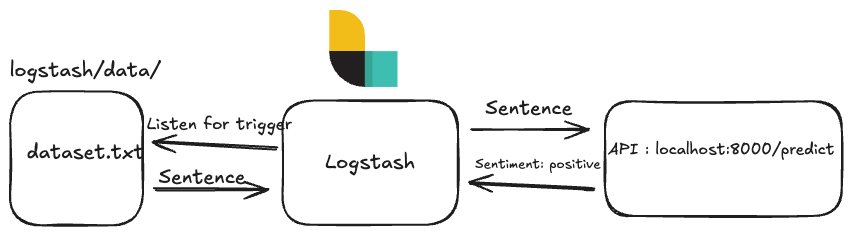

0.0 - Stack ELK déployée avec succes:

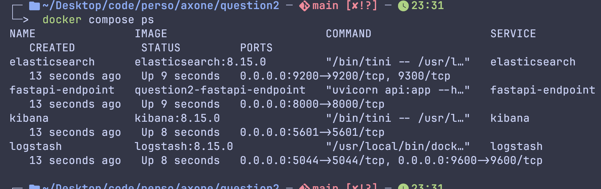

1.0 - Login :

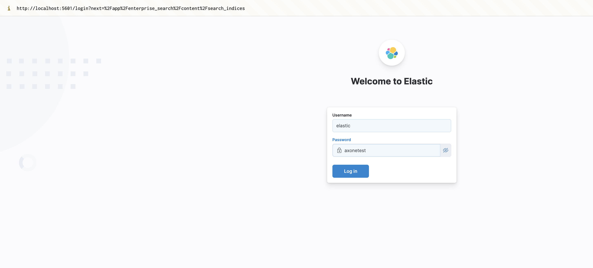

2.0 - Classification API

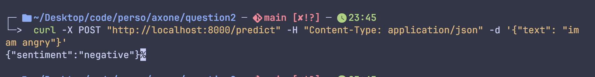

2.1 - Endpoint entrain de process la data

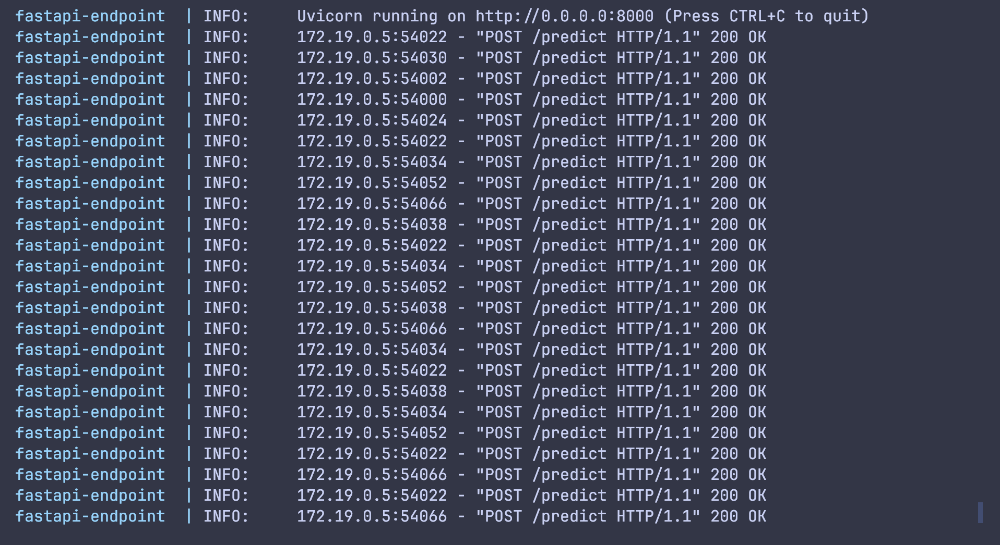

3.0 - Data avec prediction dans logstash

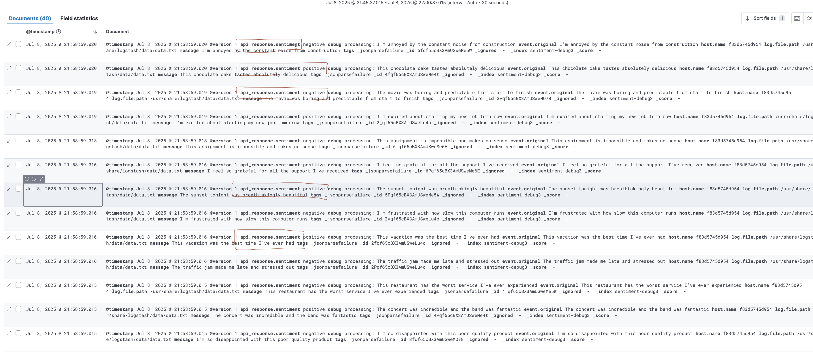

3.1 - Logstash logs

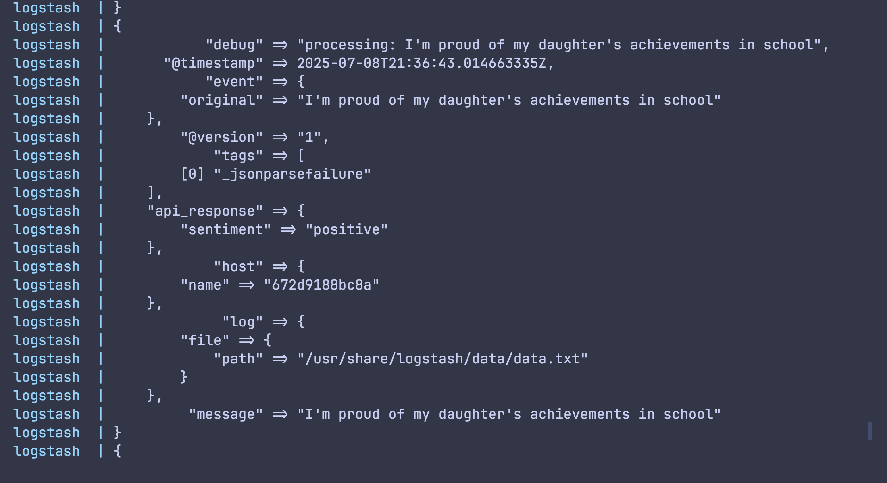

Note : Impossible de changer le logo. J'ai essayé en assignant le volume du logo mais sans résultats.

### Question 3 :

Le but de la question 3 est de scraper facebook et stocker les posts dans un document store (mongo).
Pour faire ça, on utilise `selenium` qui est un headless browser, pour bypass les mesures anti-bot et simuler des users humains. La data est scrapée en visant des css selectors, trouvés en cherchant manuellement le DOM. La data est ensuite stockée dans `data/data.csv`, puis on lance un script pour nettoyer et supprimer les duplicates, résultant en un nouveau fichier propre `data/clean.csv`.
Ensuite, travers une custom loader class, on enregistre la data dans le document store, pour pouvoir l'utiliser, potentiellement, par les analystes.

Les difficulties principales de la question, est de bypasser les mesures anti-bot et découvrir la cause de la duplication => simuler un humain (taper character par character, pause entre chaque field, stealthy headers...)
résultat :  text + images scrapés corréctement, et stockés dans mongo !

Enfin, pour avoir un workflow prêt pour être déployé en production, on crée une pipeline airflow qui execute chaque job (extract, transform, load) dans un DAG. Cependant, puisque le but est démonstratif on fait uniquement 1 scroll à cause de la lenteur de ma machine et les ressources insuffisante pour tourner docker longtemps avec plus de mémoire (5 scrolls prennent 30+ mns).

## Details :

    - comment run :
        - local :
            - install uv : `pip install uv`
            - sync uv pour install les requirements : `uv sync`
            - run : `uv run src/extract.py --query "deces jacques chirac" --num_scrolls 20`
            - puis clean la data avec : `uv run src/transform.py`
            - enfin, load la data : `uv run src/load_to_db.py`

        - airflow pipeline qui scrape, clean et load la data en une fois :
            - `airflow dags trigger axone_fb_etl_pipeline` et aller à `localhost:8080` pour l'ui

    - features :
        - text + image parsing
        - cli usage pour custom query + number de scrolls
        - mongodb storage avec docker-compose
        - tests pour la transformation + mongo i/o
        - airflow pipeline pour les production standards

    - code :
        - `extract.py` : parse facebook, extract les posts et related images. spécifier `query` et `num_scrolls`
        - `transform.py` : remove les duplicates de la parsed data
        - `load_to_db` : load la data dans une mongodb collection
        - `docker-compose.yaml` : pour le local mongodb setup
        - `dag.py` pour le airflow dag
        - `tests` mongo + transform tests

    - résultats :
        - la structure résultante du fichier :
            - post_id
            - text
            - images du post (si exists)

        - `images` contient les images scrapées de chaque post
        - `data` contient la data parsed et cleaned

**le parsing a eu environ `1367` posts et le cleaning a donné `545` clean posts pour 150 scrolls.**

Résultat :

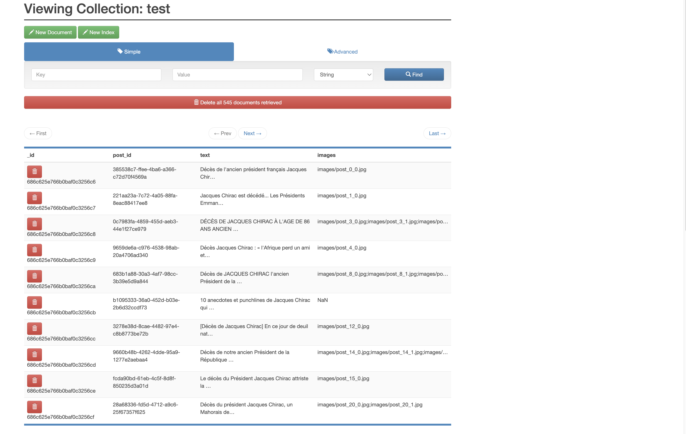

Airflow pipeline résultat :

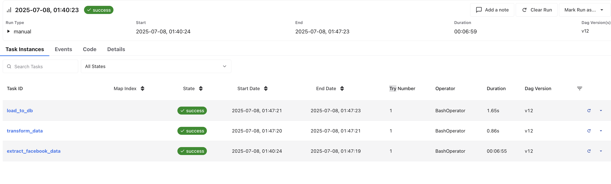
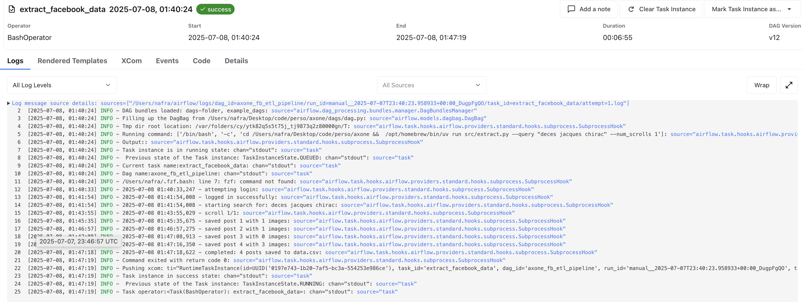
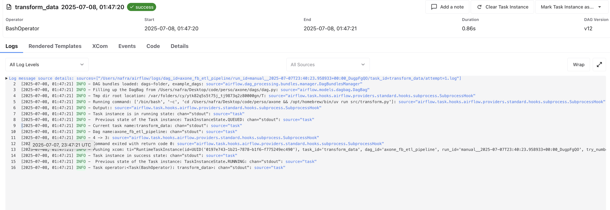
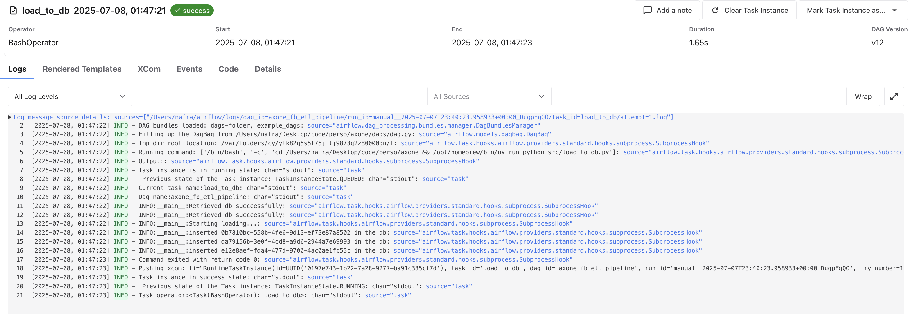
