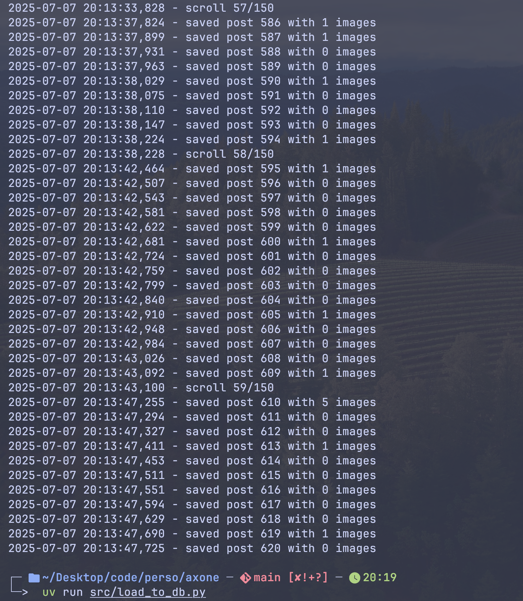
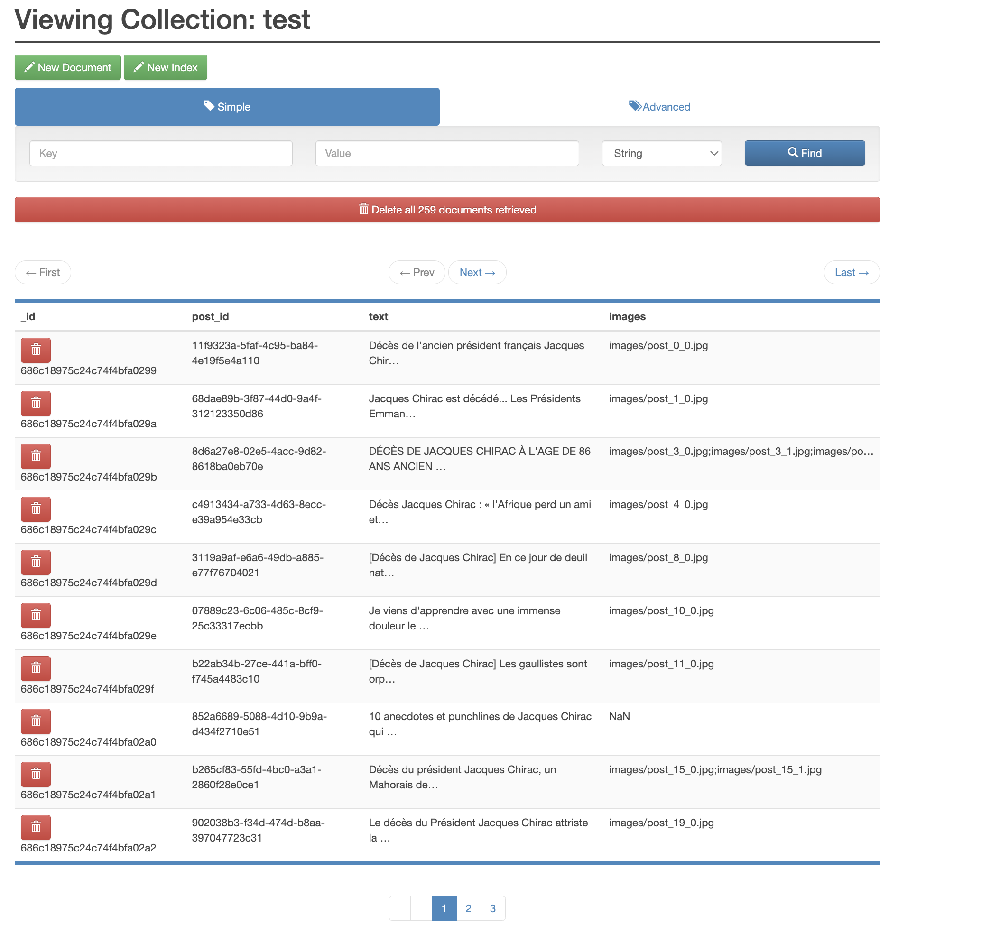
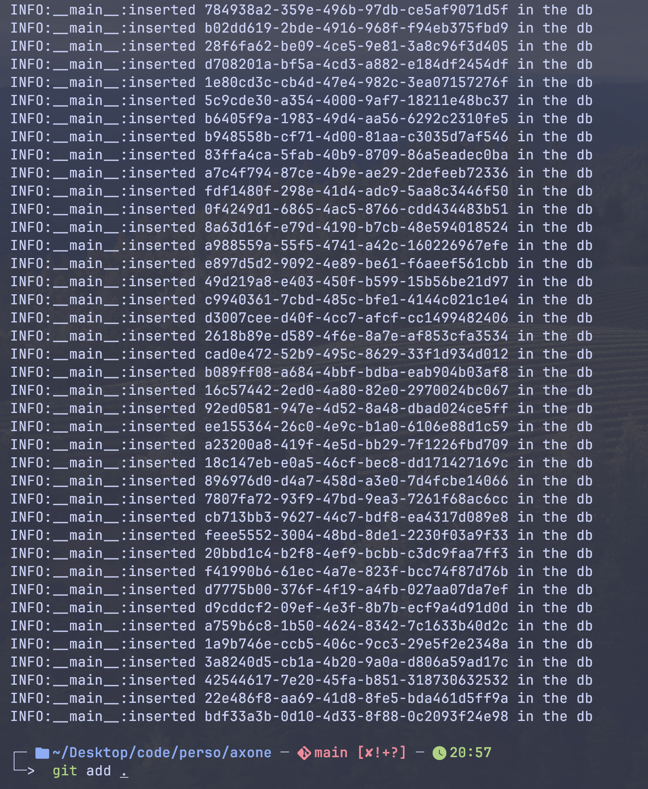

# axone-test

## Technical take-home test for axone data:

### Question 3:

The goal of question 3, is to scrape data from facebook and store them in a document store (mongo).
To achieve this, we used `selenium` which is a headless browser, to bypass anti-bot measures and simulate human users. Data is scraped by targetting some css selectors, that we found out through manual search. The data is the stored into `data/data.csv`, then we apply a script to clean and remove duplicates, resolting in a new clean file `data/clean.csv`.
Then, we use `pymongo` through a custom loader class, to load the data successfully into our document store, for potential use by our analysts.

The main difficulties of the question, is bypassing anti-bot measures and finding out the cause of the duplication. We managed to do this by simulating human behaviour (typing character by character, waiting between before each field, stealthy headers...)
We managed to correctly scrape text + images, and store them into mongo with best data quality.

## Details:

    - how to run:
        - install uv: `pip install uv`
        - sync uv to install requirements: `uv sync`
        - run :  `uv run main.py --query "deces jacques chirac" --num_scrolls 20`

    - features :
        - text + image parsing
        - cli usage for custom query + number of scrolls
        - mongodb storage with docker-compose
        - tests for the transformation + mongo i/o

    - code:
        - `extract.py` : parsers facebook, extracts posts and related images. specify `query` and `num_scrolls`
        - `transform.py`: removes duplicates from parsed data
        - `load_to_db`: load the data into a mongodb collection
        - `docker-compose.yaml`: for local mongodb setup

    - results:
        - the resulting structure:
            - post_id
            - text
            - images of the post (if exists)

        - `images` contains the images scraped from each post
        - `data` contains the data parsed and cleaned

**our parsing got around `650` posts and our cleaning gave `259` clean post for 150 scrolls.**

Result :

